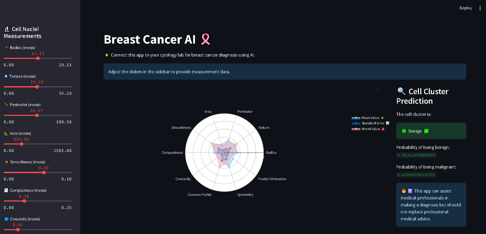

# Breast Cancer AI Project




This project is a machine learning-based application designed to assist medical professionals in diagnosing breast cancer. Using the Wisconsin Breast Cancer Dataset, the application predicts whether a breast mass is benign or malignant based on a set of cellular features. The project consists of a Python-based model training script (`model.py`) and a Streamlit web application (`app.py`).

---

## Features

- **Data Cleaning and Preprocessing:**
  - Handles missing values and removes unnecessary columns.
  - Maps diagnosis labels ('M' for malignant and 'B' for benign) to binary values (1 and 0).
- **Feature Scaling:**
  - Utilizes `StandardScaler` to normalize feature values.
- **Model Training:**
  - Logistic Regression model trained to classify breast masses with high accuracy.
- **Interactive Web Application:**
  - Allows users to input cellular measurements using sliders.
  - Displays predictions (benign or malignant) along with probability scores.
  - Visualizes the input features using radar charts.

---

## Dataset

The application uses the [Breast Cancer Wisconsin (Diagnostic) Dataset](https://www.kaggle.com/datasets/uciml/breast-cancer-wisconsin-data).

- **Number of Instances:** 569
- **Number of Features:** 32 (ID, Diagnosis, and 30 real-valued input features)
- **Target Variable:** Diagnosis (Benign: 0, Malignant: 1)

### Data Cleaning

- Removed unnecessary columns: `id` and `Unnamed: 32`.
- Converted the target variable (`diagnosis`) to numerical format:
  - `M` (Malignant) -> 1
  - `B` (Benign) -> 0

---

## Requirements

### Python Version

- Python 3.8

### Dependencies

Install the required libraries by running:
```bash
pip install -r requirements.txt
```

#### `requirements.txt` content:
```
numpy
pandas
plotly
scikit_learn
streamlit
altair
```

---

## Files

# PATH:- Model/model.py

### 1. `model.py`

This script performs the following tasks:

1. **Data Loading and Cleaning:**
   - Reads the dataset from the provided path.
   - Preprocesses the data to prepare it for training.

2. **Model Training:**
   - Trains a Logistic Regression model on the dataset.
   - Splits the data into training and testing sets (80:20 split).

3. **Evaluation:**
   - Calculates accuracy and generates a classification report.

4. **Saving Artifacts:**
   - Saves the trained model and scaler as pickle files (`model.pkl` and `scaler.pkl`).

#### Usage

Run the script to train the model and save artifacts:
```bash
python model.py
```

### 2. `app.py`

This script provides a Streamlit-based web application with the following features:

1. **Sidebar Controls:**
   - Sliders for cellular feature inputs.

2. **Radar Chart Visualization:**
   - Displays the input features in a radar chart.

3. **Prediction Display:**
   - Outputs whether the mass is benign or malignant.
   - Displays the probability of each prediction.

#### Usage

Run the web application:
```bash
streamlit run app.py
```

---

## How to Use

1. Clone this repository:
```bash
git clone https://github.com/PriyanshuDey23/BreastCancerAI.git
```

2. Download the dataset from [Kaggle](https://www.kaggle.com/datasets/uciml/breast-cancer-wisconsin-data) and place it in the `Data/` directory as `data.csv`.

3. Train the model by running:
```bash
python model.py
```

4. Launch the Streamlit application:
```bash
streamlit run app.py
```

5. Use the sliders in the sidebar to input feature values and view the predictions and radar chart.

---

## Example Output

### Web App

1. **Prediction Output:**
   - Benign or Malignant label.
   - Probability scores for both classes.

2. **Visualization:**
   - Radar chart for feature comparison.

### Model Training

Example console output:
```
Model Accuracy: 0.96
Classification Report:
               precision    recall  f1-score   support
           0       0.97      0.97      0.97       100
           1       0.95      0.95      0.95        70
    accuracy                           0.96       170
   macro avg       0.96      0.96      0.96       170
weighted avg       0.96      0.96      0.96       170
Model saved to Model/model.pkl
Scaler saved to Model/scaler.pkl
```

---

## Notes

- This application is intended for educational and research purposes. It should not replace professional medical diagnosis.
- Ensure the dataset is placed in the correct directory before training the model.

---

## License

This project is licensed under the MIT License. See the `LICENSE` file for details.

